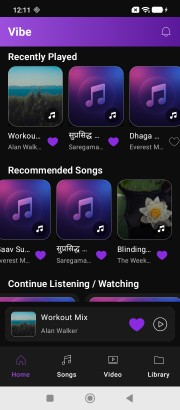
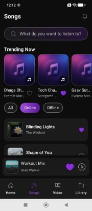
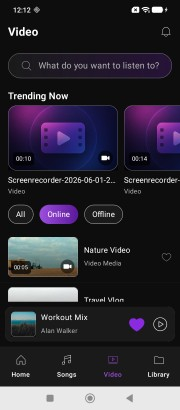
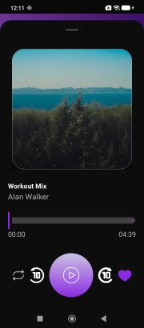
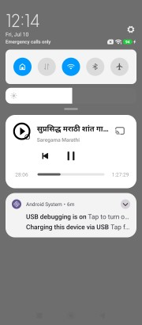
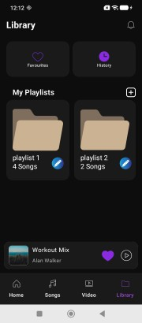
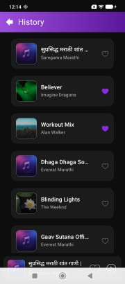
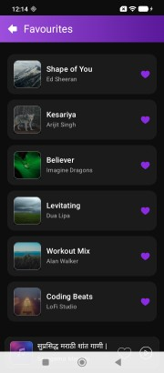

# 🎵 Vibe - Music Player

Vibe is a modern Android music player application built using **Kotlin** and **Jetpack Compose**. The application focuses on delivering a clean, responsive, and intuitive music listening experience while showcasing modern Android development practices, including **MVVM**, **Clean Architecture**, and **Material 3**.

---

## 📱 Features

* 🎧 Browse and play music with an intuitive user interface.
* 🔍 Search songs quickly and efficiently.
* ❤️ Mark songs as Favorites for quick access.
* 📂 Organize music into playlists.
* ▶️ Playback controls (Play, Pause, Next, Previous).
* 🎨 Modern UI built entirely with Jetpack Compose.
* ⚡ Smooth and responsive user experience using Kotlin Coroutines.
* 📡 Fetch music data from remote APIs.
* 💾 Cache and manage application data efficiently.

---

## 🛠️ Tech Stack

* **Language:** Kotlin
* **UI:** Jetpack Compose
* **Architecture:** MVVM + Clean Architecture
* **Dependency Injection:** Koin
* **Networking:** Retrofit
* **Image Loading:** Coil
* **Asynchronous Programming:** Kotlin Coroutines & StateFlow
* **Material Design:** Material 3
* **Version Control:** Git & GitHub

---

## 🚀 Getting Started

### Prerequisites

* Android Studio (Latest Stable Version)
* JDK 17 or above
* Android SDK 26+
* Kotlin 2.x

### Installation

1. Clone the repository.

```bash
git clone https://github.com/Vrushabh-13/Vibe-App.git
```

2. Open the project in Android Studio.

3. Sync Gradle dependencies.

4. Run the application on an emulator or physical device.

---

## 📸 Screenshots

Add screenshots of the following screens:

* Home Screen
  
* Song Tab
  
* Video Tab
  
* Player Bottom Sheet
  
* Notification
  
* Library Tab
  
* History Screen
  
 * Favourite Screen
 

---

## 📈 Future Improvements

* Offline music download
* Lyrics support
* Dark/Light theme customization
* Audio Equalizer

---

## 👨‍💻 Author

**Vrushabh Gaikar**

Android Developer passionate about building modern, scalable, and user-friendly Android applications using the latest Android technologies.

---

## 📄 License

This project is intended for learning and portfolio purposes.
